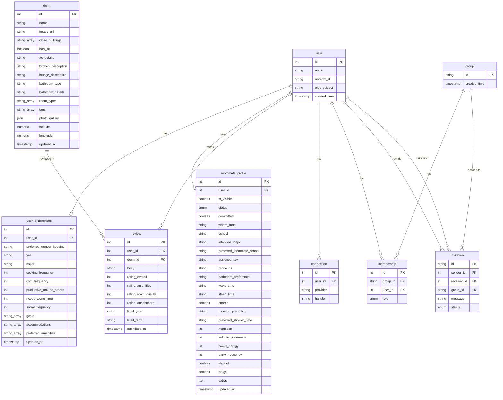

# Database Codebook

Our project uses PostGres SQL DB to serve our frontend with data storage and migrations. This document serves as a guide, or codebook, on what each value and data point is from our DB.

Schema is defined with [Drizzle ORM](https://orm.drizzle.team/) in `apps/backend/src/db/schema.ts`. Drizzle generates TypeScript types from these table definitions, so the shapes below stay in sync with the code as long as the schema file is the source of truth.

## Schema Diagram

Below is the working diagram made for our database schema which is also additionally produced in [Lucid Chart](https://lucid.app/lucidchart/cb169728-397a-4993-801b-1c5beeed62b9/edit?viewport_loc=-1247%2C-628%2C2856%2C1716%2C0_0&invitationId=inv_0eebfa91-3957-4426-a47b-316f727e67d6).



> **Note:** `connection`, `group`, `membership`, and `invitation` are not yet defined in `apps/backend/src/db/schema.ts` or in this documentation as they will be made and used when we create the Roomies.live OpenAPI. They're included above to match the current [lucid chart diagram](https://lucid.app/lucidchart/cb169728-397a-4993-801b-1c5beeed62b9/edit?viewport_loc=-1247%2C-628%2C2856%2C1716%2C0_0&invitationId=inv_0eebfa91-3957-4426-a47b-316f727e67d6), but the **Tables** and **TypeScript types** sections below only cover the five tables that actually exist in the Drizzle schema currently (`user`, `user_preferences`, `roommate_profile`, `dorm`, `review`). Once those four tables are added to `schema.ts`, this doc will be updated with their column/type details too.

## Enums

### `roommate_status`

Backing type for `roommate_profile.status`.

| Value | Meaning |
| --- | --- |
| `searching` | User is actively looking for a roommate. |
| `committed` | User has locked in a roommate/room situation. |
| `inactive` | User is not currently participating in roommate matching. |

## Tables

### `user`

Core account record. Every other table hangs off of `user.id`.

| Column | DB type | Nullable | Notes |
| --- | --- | --- | --- |
| `id` | `serial` | No (PK) | Auto-incrementing primary key. |
| `andrew_id` | `text` | Yes | CMU AndrewID for the account. |
| `created_time` | `timestamp` | Yes | When the account was created. |
| `name` | `text` | Yes | Display name. |
| `oidc_subject` | `text` | Yes | Subject claim from the OIDC identity provider (CMU SSO), used to link the login to this row. |

### `user_preferences`

One-to-one extension of `user` holding lifestyle/roommate-matching preferences.

| Column | DB type | Nullable | Notes |
| --- | --- | --- | --- |
| `id` | `serial` | No (PK) | Auto-incrementing primary key. |
| `user_id` | `integer` | No (FK → `user.id`) | Owning user. |
| `accommodations` | `text[]` | Yes | List of accessibility/accommodation needs. |
| `cooking_frequency` | `integer` | Yes | Self-reported frequency scale (e.g. times per week). |
| `goals` | `text[]` | Yes | Free-text goals for housing/roommate search. |
| `gym_frequency` | `integer` | Yes | Self-reported frequency scale. |
| `major` | `text` | Yes | Academic major. |
| `needs_alone_time` | `integer` | Yes | Self-reported scale of how much alone time is needed. |
| `preferred_amenities` | `text[]` | Yes | Desired building/room amenities. |
| `preferred_gender_housing` | `text` | Yes | Preferred gender composition for housing. |
| `productive_around_others` | `integer` | Yes | Self-reported scale of productivity with others present. |
| `social_frequency` | `integer` | Yes | Self-reported social activity scale. |
| `updated_at` | `timestamp` | Yes | Last time preferences were edited. |
| `year` | `text` | Yes | Class year (e.g. Freshman, Sophomore). |

### `roommate_profile`

One-to-one extension of `user` holding the public-facing roommate-matching profile.

| Column | DB type | Nullable | Notes |
| --- | --- | --- | --- |
| `id` | `serial` | No (PK) | Auto-incrementing primary key. |
| `user_id` | `integer` | No (FK → `user.id`) | Owning user. |
| `alcohol` | `boolean` | Yes | Whether the user drinks alcohol. |
| `assigned_sex` | `text` | Yes | Assigned sex, used for housing-eligibility matching. |
| `bathroom_preference` | `text` | Yes | Preferred bathroom arrangement. |
| `committed` | `boolean` | Yes | Whether the user has already committed to a roommate. |
| `drugs` | `boolean` | Yes | Whether the user uses drugs. |
| `extras` | `json` | Yes | Free-form additional profile data not modeled as columns. |
| `intended_major` | `text` | Yes | Intended/declared major shown on the profile. |
| `is_visible` | `boolean` | Yes | Whether the profile is visible in roommate search. |
| `morning_prep_time` | `text` | Yes | How long the user takes to get ready in the morning. |
| `neatness` | `integer` | Yes | Self-reported tidiness scale. |
| `party_frequency` | `integer` | Yes | Self-reported partying frequency scale. |
| `preferred_roommate_school` | `text` | Yes | Preferred school/college affiliation of a roommate. |
| `preferred_shower_time` | `text` | Yes | Preferred time of day to shower. |
| `pronouns` | `text` | Yes | User's pronouns. |
| `school` | `text` | Yes | User's own school/college affiliation. |
| `sleep_time` | `text` | Yes | Typical bedtime. |
| `snores` | `boolean` | Yes | Whether the user snores. |
| `social_energy` | `integer` | Yes | Self-reported social energy scale. |
| `status` | `roommate_status` enum | Yes | One of `searching`, `committed`, `inactive`. |
| `updated_at` | `timestamp` | Yes | Last time the profile was edited. |
| `volume_preference` | `integer` | Yes | Preferred noise/volume level scale. |
| `wake_time` | `text` | Yes | Typical wake-up time. |
| `where_from` | `text` | Yes | Hometown/origin. |

### `dorm`

Reference data for CMU residence halls, shared across all users (not tied to a `user_id`).

| Column | DB type | Nullable | Notes |
| --- | --- | --- | --- |
| `id` | `serial` | No (PK) | Auto-incrementing primary key. |
| `ac_details` | `text` | Yes | Description of air conditioning setup. |
| `bathroom_details` | `text` | Yes | Description of bathroom facilities. |
| `bathroom_type` | `text` | Yes | Category of bathroom (e.g. shared, private, communal). |
| `close_buildings` | `text[]` | Yes | Nearby buildings of interest. |
| `has_ac` | `boolean` | Yes | Whether the dorm has air conditioning. |
| `image_url` | `text` | Yes | Primary/cover image for the dorm. |
| `kitchen_description` | `text` | Yes | Description of kitchen facilities. |
| `latitude` | `numeric` | Yes | Geographic latitude. |
| `longitude` | `numeric` | Yes | Geographic longitude. |
| `lounge_description` | `text` | Yes | Description of lounge/common space. |
| `name` | `text` | Yes | Dorm name. |
| `photo_gallery` | `json` | Yes | Array/object of additional photo URLs. |
| `room_types` | `text[]` | Yes | Room configurations offered (e.g. single, double). |
| `tags` | `text[]` | Yes | Freeform tags for filtering/search. |
| `updated_at` | `timestamp` | Yes | Last time the dorm record was edited. |

### `review`

User-submitted reviews of a dorm. Many-to-one against both `user` and `dorm`.

| Column | DB type | Nullable | Notes |
| --- | --- | --- | --- |
| `id` | `serial` | No (PK) | Auto-incrementing primary key. |
| `dorm_id` | `integer` | No (FK → `dorm.id`) | Dorm being reviewed. |
| `user_id` | `integer` | No (FK → `user.id`) | Author of the review. |
| `body` | `text` | Yes | Free-text review content. |
| `lived_term` | `text` | Yes | Term the reviewer lived there (e.g. Fall). |
| `lived_year` | `text` | Yes | Year the reviewer lived there. |
| `rating_amenities` | `integer` | Yes | Amenities rating. |
| `rating_atmosphere` | `integer` | Yes | Atmosphere rating. |
| `rating_overall` | `integer` | Yes | Overall rating. |
| `rating_room_quality` | `integer` | Yes | Room quality rating. |
| `submitted_at` | `timestamp` | Yes | When the review was submitted. |

## Relationships

- `user (1) → (1) user_preferences` via `user_preferences.user_id`
- `user (1) → (1) roommate_profile` via `roommate_profile.user_id`
- `user (1) → (many) review` via `review.user_id`
- `dorm (1) → (many) review` via `review.dorm_id`

No `relations()` helpers are defined in `schema.ts` yet, so joins are written manually with Drizzle's query builder rather than the relational query API.

## TypeScript types

Each table is a `pgTable` object, which Drizzle can turn into `select` (row-as-read) and `insert` (row-as-write) types via `InferSelectModel` / `InferInsertModel` (or the `$inferSelect` / `$inferInsert` shorthand). These aren't hand-written anywhere yet, but adding them alongside the table definitions in `schema.ts` gives the rest of the app compile-time types for free:

```ts
import type { InferInsertModel, InferSelectModel } from "drizzle-orm";
import { userTable, userPreferencesTable, roommateProfileTable, dormTable, reviewTable } from "./schema.ts";

export type User = InferSelectModel<typeof userTable>;
export type NewUser = InferInsertModel<typeof userTable>;

export type UserPreferences = InferSelectModel<typeof userPreferencesTable>;
export type NewUserPreferences = InferInsertModel<typeof userPreferencesTable>;

export type RoommateProfile = InferSelectModel<typeof roommateProfileTable>;
export type NewRoommateProfile = InferInsertModel<typeof roommateProfileTable>;

export type Dorm = InferSelectModel<typeof dormTable>;
export type NewDorm = InferInsertModel<typeof dormTable>;

export type Review = InferSelectModel<typeof reviewTable>;
export type NewReview = InferInsertModel<typeof reviewTable>;
```

Resulting shapes (all nullable DB columns become `T | null` in the select type; `serial`/nullable columns become optional in the insert type):

```ts
type User = {
  id: number;
  andrewId: string | null;
  createdTime: Date | null;
  name: string | null;
  oidcSubject: string | null;
};

type UserPreferences = {
  id: number;
  userId: number;
  accommodations: string[] | null;
  cookingFrequency: number | null;
  goals: string[] | null;
  gymFrequency: number | null;
  major: string | null;
  needsAloneTime: number | null;
  preferredAmenities: string[] | null;
  preferredGenderHousing: string | null;
  productiveAroundOthers: number | null;
  socialFrequency: number | null;
  updatedAt: Date | null;
  year: string | null;
};

type RoommateProfile = {
  id: number;
  userId: number;
  alcohol: boolean | null;
  assignedSex: string | null;
  bathroomPreference: string | null;
  committed: boolean | null;
  drugs: boolean | null;
  extras: unknown | null; // json
  intendedMajor: string | null;
  isVisible: boolean | null;
  morningPrepTime: string | null;
  neatness: number | null;
  partyFrequency: number | null;
  preferredRoommateSchool: string | null;
  preferredShowerTime: string | null;
  pronouns: string | null;
  school: string | null;
  sleepTime: string | null;
  snores: boolean | null;
  socialEnergy: number | null;
  status: "searching" | "committed" | "inactive" | null;
  updatedAt: Date | null;
  volumePreference: number | null;
  wakeTime: string | null;
  whereFrom: string | null;
};

type Dorm = {
  id: number;
  acDetails: string | null;
  bathroomDetails: string | null;
  bathroomType: string | null;
  closeBuildings: string[] | null;
  hasAc: boolean | null;
  imageUrl: string | null;
  kitchenDescription: string | null;
  latitude: string | null; // numeric columns come back as strings from postgres-js
  longitude: string | null;
  loungeDescription: string | null;
  name: string | null;
  photoGallery: unknown | null; // json
  roomTypes: string[] | null;
  tags: string[] | null;
  updatedAt: Date | null;
};

type Review = {
  id: number;
  dormId: number;
  userId: number;
  body: string | null;
  livedTerm: string | null;
  livedYear: string | null;
  ratingAmenities: number | null;
  ratingAtmosphere: number | null;
  ratingOverall: number | null;
  ratingRoomQuality: number | null;
  submittedAt: Date | null;
};
```

A couple of notes worth knowing when consuming these types on the frontend:

- `numeric` columns (`dorm.latitude`, `dorm.longitude`) are typed as `string`, not `number`. Drizzle/postgres-js don't coerce them, to avoid floating-point precision loss. Parse with `Number()` before doing math.
- `json` columns (`roommate_profile.extras`, `dorm.photo_gallery`) type as `unknown` unless you supply a generic (`json("extras").$type<MyShape>()`), so cast/validate before use.
- Almost every non-PK, non-FK column is nullable today. None of the table definitions use `.notNull()` except for the foreign key columns. Treat every profile/preference/dorm/review field as optional when rendering the frontend.
